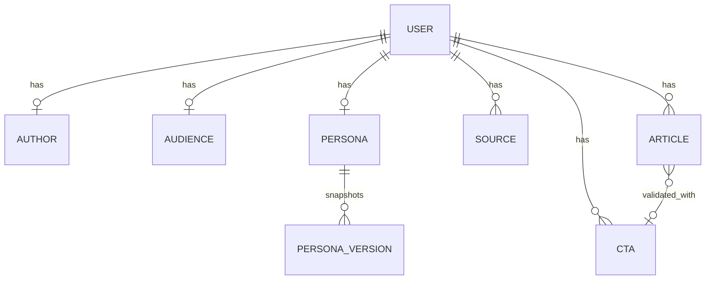

# DATA_MODEL — Firestore (ULTRA CONTENT MAKER v3)

All data is scoped to the authenticated user: `users/{userId}/...`.

**Security rule (unchanged pattern):**

```txt
match /users/{userId}/{document=**} {
  allow read, write: if request.auth != null && request.auth.uid == userId;
}
```

There is **no** `clients` collection in v2. One workspace per user.

---

## Overview diagram



---

## 1. `users/{userId}`

Root profile and app preferences.

| Field | Type | Required | Notes |
|-------|------|----------|-------|
| email | string | yes | From Auth |
| displayName | string | no | |
| preferredLocale | string | no | `en` \| `fr` \| `es` — UI language |
| setupStep | string | yes | See § Setup state machine |
| createdAt | timestamp | yes | |
| updatedAt | timestamp | yes | |

### `setupStep` values

| Value | Meaning |
|-------|---------|
| `llm` | API key not configured |
| `author` | Author profile not marked complete |
| `audience` | Author done; audience optional step |
| `persona` | Ready to generate / edit Persona |
| `articles` | Persona validated; article workflow |
| `ready` | At least one article validated (activation) |

---

## 2. `users/{userId}/llm` (singleton document)

**Document ID:** `profile`

Per-user LLM credentials (not shared server `.env`).

| Field | Type | Required | Notes |
|-------|------|----------|-------|
| provider | string | yes | `openai` \| `perplexity` \| `anthropic` \| `google` |
| apiKey | string | yes | Stored client-side in Firestore; sent to API routes over HTTPS |
| model | string | no | Default per provider if omitted |
| configuredAt | timestamp | yes | |
| updatedAt | timestamp | yes | |

---

## 3. `users/{userId}/author` (singleton document)

**Document ID:** `profile` (fixed single doc per user)

Describes **who I am** — link-first, all fields optional.

| Field | Type | Required | Notes |
|-------|------|----------|-------|
| linkedinProfileUrl | string | no | URL |
| websiteUrl | string | no | URL |
| blogUrl | string | no | URL — blog home or main page |
| contentLanguage | string | no | Default `en` — language of **generated** posts |
| roleTitle | string | no | Short, e.g. "Founder" |
| positioningLine | string | no | One line, optional if user wants to type it |
| status | string | yes | `not_started` \| `in_progress` \| `complete` |
| updatedAt | timestamp | yes | |

**Rule:** No field is required to save. `complete` means user explicitly finished the step (can be partial data).

---

## 3. `users/{userId}/audience` (singleton document)

**Document ID:** `profile`

Simple target sketch — all optional.

| Field | Type | Required | Notes |
|-------|------|----------|-------|
| targetLabel | string | no | General type, e.g. "French SMBs expanding abroad" |
| contentFocus | string | no | What to highlight (themes, angles)—not service catalog |
| newsInterestQuery | string | no | Keywords / topics for news scan (creation wizard) |
| optionalNotes | string | no | Free text |
| skipped | boolean | no | `true` if user skipped step |
| updatedAt | timestamp | yes | |

---

## 4. `users/{userId}/sources/{sourceId}`

**URL-only** professional references (no `rawText` in MVP).

| Field | Type | Required | Notes |
|-------|------|----------|-------|
| type | string | yes | `linkedin_profile` \| `linkedin_post` \| `blog` \| `website` \| `other` |
| url | string | yes | Valid https URL |
| label | string | no | User-friendly name |
| sortOrder | number | no | Display order |
| createdAt | timestamp | yes | |

**Examples**

- LinkedIn post: `https://www.linkedin.com/posts/...`  
- Blog article: `https://myblog.com/article-slug`  

**MVP note:** Text is **not** scraped automatically; URLs are passed to the LLM as context references. Phase 2 may add fetch/cache subcollection `sources/{id}/cache`.

---

## 5. `users/{userId}/enrichment` (singleton)

**Document ID:** `profile`

Answers from the Persona gap questionnaire (and other enrichment).

| Field | Type | Required | Notes |
|-------|------|----------|-------|
| details | map | yes | Keys = `profileKey` or question `id`; values = string or string[] |
| updatedAt | timestamp | yes | |

Used on next Persona / article generation via `profileEnrichment` in the LLM payload.

---

## 6. `users/{userId}/persona/current` (singleton)

The **expert writing prompt** — the core Persona deliverable.

| Field | Type | Required | Notes |
|-------|------|----------|-------|
| promptText | string | yes | Long markdown/plain expert prompt |
| gapQuestions | array | no | Interactive questionnaire (labels in `contentLanguage`) |
| status | string | yes | `none` \| `draft` \| `validated` |
| model | string | no | e.g. `gpt-4o` |
| generatedFrom | map | no | `{ authorUpdatedAt, audienceUpdatedAt, sourceIds[] }` |
| validatedAt | timestamp | no | |
| updatedAt | timestamp | yes | |

### `users/{userId}/persona/versions/{versionId}`

Snapshot when user validates Persona (audit / rollback).

| Field | Type |
|-------|------|
| promptText | string |
| createdAt | timestamp |

### `users/{userId}/insights/performance` (singleton, v3 phase 3)

Cached output of Persona performance synthesis (LLM).

| Field | Type | Notes |
|-------|------|-------|
| summary | string | 3–5 sentences |
| suggestions | array | Bullet suggestions for Persona updates |
| postsAnalyzed | number | Count of validated posts with signals |
| generatedAt | timestamp | |

### `performanceSignals` on article (manual entry)

| Field | Type | Notes |
|-------|------|-------|
| saves | number | optional |
| qualifiedComments | number | optional |
| profileVisits | number | optional |
| dms | number | optional |
| businessOpportunity | string | optional |
| notes | string | optional |
| recordedAt | string | ISO date `YYYY-MM-DD` |

---

## 6. `users/{userId}/ctas/{ctaId}`

Reusable CTAs for signatures.

| Field | Type | Required | Notes |
|-------|------|----------|-------|
| label | string | yes | Internal name, e.g. "Newsletter Q2" |
| text | string | yes | What appears in signature |
| linkUrl | string | no | Optional URL appended or in text |
| isDefault | boolean | no | Pre-select in picker |
| createdAt | timestamp | yes | |
| updatedAt | timestamp | yes | |

---

## 7. `users/{userId}/articles/{articleId}`

Sample LinkedIn posts (3–4 per batch) with refinement and export.

| Field | Type | Required | Notes |
|-------|------|----------|-------|
| batchId | string | yes | Same UUID for one "Generate 3–4" run |
| indexInBatch | number | yes | 0–3 |
| status | string | yes | See lifecycle below |
| hook | string | no | |
| body | string | no | Main post text |
| ps | string | no | Pre-CTA PS line if any |
| exportText | string | no | Final text after validation (body + CTA block) |
| selectedCtaId | string | no | Set on validate |
| contentLanguage | string | yes | Copy from author at generation time |
| refinement | map | no | See § Refinement |
| postBrief | map | no | v3 — `{ objective, problem, pointOfView, proof }` used at generation |
| qualityScores | map | no | v3 — `{ nicheClarity, humanPov, proofDensity, conversationPotential }` (1–10) |
| alternativeHooks | array | no | v3 — up to 3 hook lines from quality analysis |
| qualityCritique | string | no | v3 — short editor note from quality API |
| postFormatPlan | map | no | v3 — `{ primaryFormat, rationale, alternativeFormats? }` |
| repurpose | map | no | v3 — `{ carousel?, videoScript? }` |
| suggestedFirstComment | string | no | v3 — author seed comment for distribution |
| performanceSignals | map | no | v3 phase 3 — manual LinkedIn metrics after validation |
| slopAnalysis | map | no | v3 phase 3 — `{ humanScore, slopScore, flags[], summary }` |
| newsSource | map | no | When generated from news |
| scope | string | no | `generalist` \| `niche` |
| hashtags | array | no | Up to 4 tags without `#` |
| illustration | map | no | Format + image prompts |
| createdAt | timestamp | yes | |
| updatedAt | timestamp | yes | |
| validatedAt | timestamp | no | |

### `postBrief` (v3)

| Field | Type | Values |
|-------|------|--------|
| objective | string | `awareness` \| `credibility` \| `conversation` \| `leads` |
| problem | string | ICP pain / question |
| pointOfView | string | Author belief / contrarian take |
| proof | string | Case, metric, field observation |

### `users/{userId}/newsArchive/{newsId}`

Archived news suggestions (dedupe by stable URL id).

| Field | Type | Notes |
|-------|------|-------|
| title, summary, url, publishedAt | string | Same as `NewsSuggestion` |
| sourceName | string | optional |
| archivedAt | timestamp | First seen |
| lastFetchedAt | timestamp | Last refresh batch |

### Article `status` lifecycle

```txt
draft → refining → validated
         ↑__________|  (regenerate loops, still refining)
```

| Status | Meaning |
|--------|---------|
| `draft` | Just generated, refinement not started |
| `refining` | User answered or partially answered questions |
| `validated` | User approved; CTA attached; `exportText` set |

### `refinement` map

| Field | Type | Notes |
|-------|------|-------|
| questions | array | Fixed 3–4 items at generation time |
| questions[].id | string | `tone`, `theme`, `length`, `hook` |
| questions[].questionKey | string | i18n key reference |
| questions[].answer | string | no | `yes` \| `no` \| `partial` or 1–5 scale |
| questions[].comment | string | no | Per-question optional |
| globalComment | string | no | Free-text under questions |
| lastRegeneratedAt | timestamp | no | |

---

## 8. `users/{userId}/generations/{generationId}`

LLM audit log (cost/debug).

| Field | Type | Notes |
|-------|------|-------|
| type | string | `persona` \| `articles` \| `article_revision` |
| model | string | |
| tokensIn | number | optional |
| tokensOut | number | optional |
| durationMs | number | optional |
| articleId | string | optional |
| batchId | string | optional |
| error | string | optional |
| createdAt | timestamp | |

---

## 9. `users/{userId}/analyticsEvents/{eventId}`

| Field | Type |
|-------|------|
| eventName | string |
| payload | map |
| createdAt | timestamp |

**Suggested events:** `author_saved`, `audience_skipped`, `persona_generated`, `persona_validated`, `articles_generated`, `article_validated`, `export_copied`.

---

## Deprecated (v1 — do not use in new code)

| Path | Replacement |
|------|-------------|
| `users/{uid}/clients/{clientId}` | `author` + `audience` + `persona` |
| `.../onboarding/{step}` | `author`, `audience`, `sources` |
| `.../contentBrain/current` | `persona/current` |
| `.../postIdeas` | removed |
| `.../generatedPosts` | `articles` |

---

## Composite indexes

| Collection | Fields | Query use |
|------------|--------|-----------|
| `sources` | `sortOrder` ASC | Ordered list |
| `articles` | `batchId` ASC, `indexInBatch` ASC | Load batch |
| `articles` | `status` ASC, `updatedAt` DESC | Dashboard “my drafts” |
| `ctas` | `updatedAt` DESC | CTA library |
| `generations` | `createdAt` DESC | Recent runs |

---

## Storage

**None in MVP.** No PDF binaries. URLs only.

---

## Server / client access

| Operation | Where |
|-----------|--------|
| CRUD author, audience, sources, ctas | Client SDK (rules) |
| Read/write articles, persona | Client SDK |
| OpenAI Persona + articles + revision | Server Action or Route Handler with `OPENAI_API_KEY`; verify Firebase session |

---

## Validation rules (application layer)

| Rule | Enforce |
|------|---------|
| URL fields | `https?://` parseable |
| Generate Persona | `author.status === complete` OR ≥1 source URL |
| Generate articles | `persona.status === validated` |
| Validate article | `selectedCtaId` exists; `hook`+`body` non-empty |
| Max sources | 20 per user (soft limit) |
| Max CTAs | 50 per user (soft limit) |

---

## Related docs

- `PRD.md` — product scope  
- `USER_FLOW.md` — routes and screens  
- `PROMPT_ARCHITECTURE.md` — LLM contracts  
