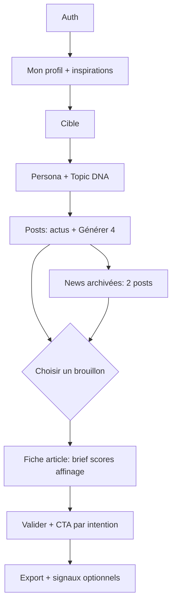

# PRD — ULTRA CONTENT MAKER (v3 — LinkedIn Authority)

**Statut :** document de lancement actif  
**Supersedes :** PRD MVP v2 pour le planning produit et les prochains sprints  
**Dernière mise à jour :** mai 2026

**Docs liées :** `DATA_MODEL.md`, `USER_FLOW.md`, `PROMPT_ARCHITECTURE.md`, `I18N.md`, `DEPLOY_VERCEL.md`

---

## 1. Résumé produit

| | |
|---|---|
| **Nom** | Ultra Content Maker |
| **Type** | Web app B2B / prosumer, workspace mono-utilisateur |
| **Positionnement** | **LinkedIn authority operating system** — pas un simple générateur de posts |
| **Cas d’usage** | Un expert / fondateur définit une **expertise lisible sur LinkedIn** (Topic DNA + Persona), produit des **posts adaptés à LinkedIn 2026** (POV, preuve, conversation, formats natifs), **choisit** parmi plusieurs brouillons ou **affûte un** post, valide + CTA, publie manuellement sur LinkedIn |

**Ce n’est pas :** un CRM multi-clients, un outil de scheduling, un optimiseur « viral », une publication automatique LinkedIn.

---

## 2. Problème

Les utilisateurs peuvent déjà obtenir un Persona et des posts « corrects », mais :

- Le contenu reste souvent **trop générique** pour la niche visée  
- Peu de **preuve concrète** (cas, donnée, observation terrain)  
- Les fins de post sont orientées **signature / vente** plutôt que **conversation qualifiée**  
- Pas de garde-fous **plateforme** (lien dans le corps, ton IA creux, hook faible)  
- Pas de boucle **mesure** (saves, DMs, commentaires utiles, attribution business)

---

## 3. Vision

**Système en 4 couches**, toutes guidées par le Persona :

| Couche | Rôle dans l’app |
|--------|------------------|
| **Positioning** | Topic DNA, croyances, hors-sujet, règles LinkedIn 2026 encodées dans le Persona |
| **Post design** | Brief intentionnel → génération (1 / 2 / 4 posts) → Quality Panel → affinage |
| **Distribution** | Export, avertissements lien, 1er commentaire suggéré (phase 2) |
| **Measurement** | Saisie manuelle des signaux post-publication (phase 3) |

**Validation humaine :** Persona (recommandé), chaque post avant export.

**North star :** Un post **validé**, avec **preuve visible** et une **fin adaptée à l’objectif** (souvent conversation), copié vers LinkedIn.

---

## 4. Proposition de valeur

> Collez des liens vers qui vous êtes et ce que vous publiez. Obtenez un **Persona expert** qui encode votre **Topic DNA**. Générez des **plusieurs brouillons intentionnels** ou affûtez **un** post, optimisez hook et qualité LinkedIn, choisissez un CTA par objectif, copiez sur LinkedIn.

**Différenciation :** Le **Persona est l’actif stratégique** (système d’écriture + positioning), complété par un **brief par post** et un **Quality Panel** — pas un formulaire one-shot ni un lot de posts interchangeables.

---

## 5. Utilisateurs cibles

| Persona | Besoin |
|---------|--------|
| **Principal** | Fondateur / expert qui publie sur LinkedIn avec sa voix |
| **Secondaire** | Ghostwriter ou consultant avec **un** positionnement stable |
| **Hors scope** | Agences gérant des dizaines de marques séparées (futur : workspaces) |

---

## 6. Glossaire

| Terme | Définition |
|-------|------------|
| **Mon profil (Author)** | Identité pro : URLs LinkedIn, site, blog, posts exemples |
| **Cible (Audience)** | Esquisse courte du lecteur et des thèmes |
| **Persona** | Prompt expert long, réutilisable pour toute génération |
| **Topic DNA** | Piliers thématiques (3–5), croyances (2–3), hors-sujet — expertise identifiable |
| **Brief post** | Problème, POV, preuve, objectif (complète le Persona pour un post donné) |
| **Objectif post** | `awareness` \| `credibility` \| `conversation` \| `leads` |
| **Article / post** | Brouillon LinkedIn (`hook`, `body`, `ps`, scope, hashtags…) |
| **Mode exploration** | Génération de **4 posts** pour comparer des angles |
| **Mode publication** | **Un** post choisi, affûté via Quality Panel + hooks alternatifs |
| **Quality Panel** | 4 jauges (niche, POV humain, preuve, conversation) + actions correctives |
| **Source link** | URL (profil, post, blog…) — pas de collage d’articles complets en MVP |
| **Actu archivée** | Suggestion news persistée en Firestore pour réutilisation sans nouvel appel LLM |

---

## 7. Modèle de génération (4 posts conservés)

| Mode | Déclencheur | Sortie | Statut |
|------|-------------|--------|--------|
| **Lot standard** | Posts — « Générer 4 posts » | 4 brouillons (2 généralistes + 2 niche) | ✅ Livré — **défaut** |
| **Depuis actu** | Actu sélectionnée sur Posts | 4 posts ancrés sur l’actu | ✅ Livré |
| **Depuis archive** | `/news` — actu archivée | 2 posts (1 généraliste + 1 niche) | ✅ Livré |
| **Post ciblé** | Brief + objectif → 1 brouillon | 1 post + hooks alternatifs + scores | 🔜 Phase 1 (option) |
| **Affûtage** | Fiche `/articles/[id]` après choix | Quality Panel + revise guidé | 🔜 Phase 1 |

**Règle produit :** les **4 posts** restent le mode **exploration** par défaut. Le **1 post affûté** est le mode **publication**, en complément — pas un remplacement du lot de 4.

**Règle UX :** après génération d’un lot, l’utilisateur reste sur la **liste des posts** ; aucune ouverture automatique du premier brouillon.

---

## 8. Parcours utilisateur (v3)

### Étapes

1. **Auth** — E-mail + Google (Firebase).  
2. **Mon profil** — URLs, rôle, ligne de positionnement, langue de contenu, liens sources (mes posts + inspirations).  
3. **Cible** — Champs courts optionnels ou skip.  
4. **Persona** — Génération prompt expert + **Topic DNA** + gap questions → édition → validation.  
5. **Posts** — Brief (phase 1) → lot 4 ou actu → grille de brouillons.  
6. **Fiche post** — Affinage, Quality Panel, hooks alternatifs, illustration, tone edge.  
7. **Validation** — CTA selon objectif + `exportText`.  
8. **Export** — Copie presse-papiers ; avertissement si lien dans le corps (phase 1).  
9. **News** — Archive des actus, détail, génération 2 posts (flux existant).

---

## 9. Baseline livrée (avant v3 — fondation technique)

Considérer comme **v2.5 déjà en production** :

| Domaine | Fonctionnalités |
|---------|-----------------|
| Persona | Génération, édition, validation, gap questions, enrichissement, **historique** (10 mises à jour / 3 mois) |
| Sources | Mes posts + inspirations (aspects, pourquoi) |
| Posts | Lots 4, scope généraliste/niche, emojis, tone contrarian, hashtags, revise, CTA 3 intensités |
| Actus | Fetch &lt; 7 j, sélection, 4 posts ; **archive Firestore** + `/news` (2 posts) |
| Illustration | Format recommandé + 3 prompts image |
| i18n | FR / EN / ES (`next-intl`) |
| Infra | Firebase Auth + Firestore, clé LLM utilisateur, déploiement Vercel |

---

## 10. Périmètre v3 — plan d’exécution

### Phase 1 — LinkedIn Authority Core (lancement immédiat)

**Objectif :** posts plus crédibles et conversationnels **sans supprimer** le flux 4 posts.

| ID | Livrable | Détail | Critère d’acceptation |
|----|----------|--------|------------------------|
| 1.1 | **Topic DNA dans le Persona** | Piliers, croyances, hors-sujet, règles anti-slop / LinkedIn 2026 dans le markdown généré | Persona validé contient sections Topic DNA non vides |
| 1.2 | **Gap questions** | Objectif LinkedIn trimestriel, politique preuve / cas clients, préférence CTA | Réponses stockées dans `profileEnrichment` |
| 1.3 | **Mini-brief avant génération** | Objectif (4 valeurs), problème, POV, **preuve obligatoire** | Impossible de lancer « Générer 4 » sans preuve + objectif |
| 1.4 | **Prompts articles v3** | Brief injecté ; preuve visible ; fin discussion ; pas de lien corps ; anti engagement bait | Posts générés respectent les règles en prompt |
| 1.5 | **Post Quality Panel** | Jauges : niche, POV, preuve, conversation + actions (preuve / hook / fin) | Visible sur `/articles/[id]` |
| 1.6 | **Hooks alternatifs** | 3 premières lignes proposées sans regénérer tout le corps | Sélection remplace le hook |
| 1.7 | **CTA par intention** | `conversation` \| `save` \| `leads` (en complément ou évolution des 3 intensités) | CTA conversation = question ouverte ICP |
| 1.8 | **Link risk warning** | Détection URL dans `body` avant export | Avertissement affiché |
| 1.9 | **Documentation** | Aligner `USER_FLOW`, `DATA_MODEL`, `PROMPT_ARCHITECTURE` | Cohérence avec ce PRD |

**Hors Phase 1 :** repurpose carrousel/vidéo, OAuth LinkedIn, scheduling, analytics officielles, multi-persona.

### Phase 1 — statut d’implémentation (code)

| ID | Statut |
|----|--------|
| 1.1 Topic DNA (prompt Persona) | ✅ |
| 1.2 Gap questions (prompt) | ✅ |
| 1.3 Mini-brief UI | ✅ |
| 1.4 Prompts articles v3 | ✅ |
| 1.5 Post Quality Panel | ✅ |
| 1.6 Hooks alternatifs | ✅ |
| 1.7 CTA par intention | ✅ |
| 1.8 Link risk warning | ✅ |
| 1.9 Documentation | ✅ |

**Ordre d’implémentation suggéré :**

1. Semaine 1 — 1.1 Topic DNA + 1.2 gap questions + modèle de données  
2. Semaine 2 — 1.3 brief UI + 1.4 prompts generate / from-news  
3. Semaine 3 — 1.5 Quality Panel + 1.6 hooks alternatifs + 1.7 CTA intention  
4. Semaine 4 — 1.8 link warning + 1.9 docs + tests pilote  

**Décision Phase 1 :** le mode **« 1 post ciblé »** (ligne du tableau §7) est **optionnel** pour le premier release ; le minimum est **4 posts + affûtage sur fiche article**.

---

### Phase 2 — Format & distribution

| ID | Livrable |
|----|----------|
| 2.1 | Format recommender unifié (texte / outline carrousel / script vidéo courte) |
| 2.2 | Repurpose depuis un post validé (slides + script) |
| 2.3 | 1er commentaire suggéré pour lancer la discussion |
| 2.4 | Niche clarity check pré-génération (brief trop vague) |

### Phase 2 — statut d’implémentation (code)

| ID | Statut |
|----|--------|
| 2.1 Format recommender unifié | ✅ |
| 2.2 Repurpose carrousel + script vidéo | ✅ |
| 2.3 1er commentaire suggéré | ✅ |
| 2.4 Niche clarity check (heuristique + IA) | ✅ |

---

### Phase 3 — Measurement loop

| ID | Livrable |
|----|----------|
| 3.1 | Fiche signaux par post validé (saves, commentaires qualifiés, visites profil, DMs, opportunité) |
| 3.2 | Synthèse → suggestions de mise à jour Persona |
| 3.3 | AI-slop detector (patterns + score POV) |

### Phase 3 — statut d’implémentation (code)

| ID | Statut |
|----|--------|
| 3.1 Fiche signaux post validé | ✅ |
| 3.2 Synthèse Persona (`/api/persona/insights` + panneau Persona) | ✅ |
| 3.3 AI-slop detector (heuristique + panneau éditeur) | ✅ |

---

## 11. Exigences fonctionnelles (v3)

### 11.1 Mon profil & sources

- Champs author : voir `DATA_MODEL`.  
- Sources : `my_post`, `inspiration_post`, `inspiration_profile` avec aspects et `whyLike`.  
- Tous les champs optionnels sauf contraintes URL si renseignées.

### 11.2 Persona

- Génération LLM → `promptText` long + `gapQuestions`.  
- **Topic DNA** obligatoire dans la structure générée (phase 1).  
- Statut `draft` \| `validated` ; gate avant génération de posts.  
- Historique des versions avant écrasement (limite 10 / 3 mois).

### 11.3 Génération de posts

- **Défaut : 4 posts** par lot (2 généraliste + 2 niche).  
- **Actu archivée : 2 posts** (1 + 1).  
- **Brief** : objectif + preuve minimum requis avant génération (phase 1).  
- Langue : `contentLanguage` (fr \| en \| es).  
- Pas de navigation automatique vers le premier post après génération.

### 11.4 Fiche post & affinage

- Questions d’affinage existantes + intents phase 1 : plus de preuve, plus niche, fin discussion, moins générique.  
- Tone edge contrarian (cadré, pas insultant / politique / raciste).  
- Illustration : format + 3 prompts image (existant).  
- **Quality Panel** + hooks alternatifs (phase 1).

### 11.5 CTA & validation

- Bibliothèque CTA utilisateur (existant).  
- **CTA par intention** aligné sur l’objectif du brief (phase 1).  
- `exportText` = corps + CTA + hashtags.  
- **Link warning** si URL dans le corps (phase 1).

### 11.6 Actualités

- Fetch suggestions &lt; 7 jours (LLM, Perplexity recommandé).  
- **Archivage** automatique à chaque fetch réussi.  
- Page `/news` : liste, détail, génération 2 posts.

### 11.7 Navigation

| Route | Écran |
|-------|--------|
| `/setup/author`, `/setup/audience`, `/setup/inspirations`, `/setup/llm` | Onboarding profil |
| `/persona` | Persona + Topic DNA |
| `/articles`, `/articles/[id]` | Posts + fiche |
| `/news` | News archivées |
| `/login`, `/signup` | Auth |

---

## 12. Hors scope

- Multi-persona / multi-marque par compte  
- OAuth LinkedIn, scrape auto des posts, publication planifiée  
- Analytics LinkedIn officielles  
- Agences, collaboration équipe, facturation  
- Mode « viral » sans Topic DNA  
- Remplacement systématique des 4 posts par un seul mode unique  

---

## 13. Exigences non fonctionnelles

| Contrainte | Cible |
|------------|--------|
| Premier écran interactif après auth | &lt; 3 s (dev local) |
| Timeout génération Persona | 60–120 s |
| Timeout lot articles | 90–120 s |
| Firestore | `users/{uid}/**` — lecture/écriture propriétaire uniquement |
| Secrets serveur | Clés plateforme optionnelles ; clé LLM utilisateur côté client chiffrée en transit |

---

## 14. KPIs pilote v3

| Métrique | Cible |
|----------|--------|
| Inscription → profil author sauvegardé | 80 % |
| Profil → Persona validé avec Topic DNA | 60 % |
| Génération avec preuve + objectif renseignés | 80 % des lots |
| ≥ 1 post validé et copié | 40 % |
| Parmi validés → clic copie | 70 % |

---

## 15. Critères de release pilote v3

Un utilisateur connecté peut :

1. Valider un Persona contenant **Topic DNA** explicite.  
2. Renseigner un **brief** (objectif + preuve) et générer **4 posts** sans ouverture auto du premier.  
3. Choisir un brouillon, voir le **Quality Panel**, utiliser des **hooks alternatifs**.  
4. Valider avec un **CTA conversation** et exporter (avec avertissement si lien dans le corps).  
5. Utiliser **News archivées** pour générer **2 posts**.  
6. Parcourir l’UI en **FR, EN ou ES** sans clés manquantes.

---

## 16. Stack technique

| Couche | Choix |
|--------|--------|
| App | Next.js 16 App Router, TypeScript, Tailwind |
| i18n | next-intl — UI FR / EN / ES |
| Auth & DB | Firebase Auth + Firestore |
| LLM | Clé utilisateur (OpenAI, Perplexity, Anthropic, Google) |
| Proxy | `src/proxy.ts` (next-intl) |
| Deploy | Vercel — https://ultra-content-maker.vercel.app |

---

## 17. Principes de design

1. **Persona = système** — voix + Topic DNA + règles plateforme.  
2. **Exploration vs publication** — 4 brouillons pour choisir ; 1 post affûté pour publier.  
3. **Preuve avant inspiration** — ancrage métier obligatoire (phase 1).  
4. **Conversation &gt; vanity** — fins de post et CTAs selon objectif.  
5. **Natif LinkedIn** — formats, liens, anti-slop explicites.  
6. **Optionnel par défaut** sur le profil ; **brief minimal obligatoire** à la génération (phase 1).  
7. **Copy-paste finish** — LinkedIn reste l’outil de publication.

---

## 18. Questions ouvertes

- Scrape / OpenGraph des URLs sources pour enrichir le Persona  
- Mode « 1 post ciblé » dès la page Posts (vs affûtage seulement sur fiche)  
- Limites de crédits / coût LLM par utilisateur  
- Import OAuth LinkedIn  

---

## Annexe — PRD MVP v2 (archive résumée)

Le v2 définissait : workspace mono-utilisateur, Persona comme livrable, lots 3–4 posts, affinage Q&A, CTA, copy-paste, sans multi-clients. La v3 **conserve** ce socle et ajoute **Topic DNA, brief post, Quality Panel, CTAs par intention, garde-fous LinkedIn 2026** et la roadmap phases 2–3. Les fonctionnalités v2.5 listées en §9 ne figuraient pas dans le PRD v2 d’origine ; elles sont désormais la baseline documentée.
