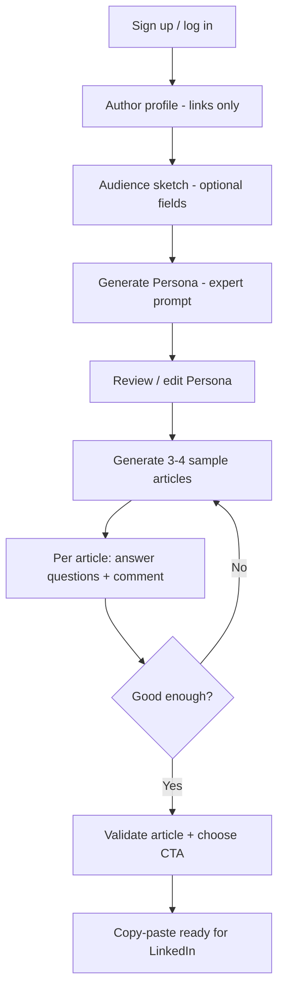

# PRD — ULTRA CONTENT MAKER (MVP v2)

## 1. Product summary

**Product name:** ULTRA CONTENT MAKER  
**Type:** B2B / prosumer web application (single-user workspace)  
**Core use case:** Help **one author** define how they write on LinkedIn—using **links** (not copy-paste), a **light audience sketch**, and a generated **expert writing prompt (Persona)**—then produce **sample posts**, refine them with **guided questions**, attach a **CTA**, and **copy-paste** to LinkedIn.

**Not a multi-client CRM.** There is no list of “clients.” The user configures **themselves** first, then **who they write for**, then receives a **long expert prompt** that acts as their LinkedIn writing assistant.

## 2. Problem

Consultants and founders know *roughly* who they are and who they want to reach, but:

- Context lives in scattered URLs (LinkedIn, site, blog)—not in one structured place  
- Generic ChatGPT prompts produce generic LinkedIn posts  
- There is no durable “how I write + for whom” document to reuse  
- Refinement (tone, angle, CTA) is ad hoc, not guided  

## 3. Vision

**Your LinkedIn writing OS:** link-based author profile → simple target → **expert Persona prompt** (multi-page if needed) → sample articles → Q&A refinement → validated post + CTA → copy to LinkedIn.

Human validation at: Persona (optional but recommended), each article before export.

## 4. Target users

| Persona | Need |
|---------|------|
| **Primary** | Founder / expert posting on LinkedIn in their own voice |
| **Secondary** | Ghostwriter or consultant writing **as themselves** or for **one** stable positioning |
| **Out of MVP** | Agencies managing dozens of separate client accounts (future: workspaces) |

## 5. Value proposition

> Paste links to who you are and what you’ve published. Get a precise expert prompt that knows how you should write on LinkedIn. Generate a few posts, refine with short questions, pick a CTA, copy-paste.

**Differentiation:** The **Persona is the deliverable**—a long, reusable expert prompt—not a shallow form or a one-shot post generator.

## 6. Core concepts (glossary)

| Term | Meaning |
|------|---------|
| **Author (Moi)** | The logged-in user’s professional identity: LinkedIn, site, example post **URLs** |
| **Audience (Cible)** | A **simple**, mostly optional sketch of the general reader/target and content themes |
| **Persona** | The generated **expert system prompt** (long text) used for all article generation |
| **Source link** | Any URL (LinkedIn post, profile, blog article, website page)—**no pasted full articles** in MVP |
| **Sample article** | One of 3–4 LinkedIn posts generated from the Persona |
| **Refinement** | Per article: 3–4 fixed questions (tone, theme, etc.) + optional free-text comment; may trigger regen |
| **CTA** | Reusable call-to-action line; **one chosen per validated article** (signature) |

## 7. User journey (MVP)

### Step details

1. **Auth** — Email + Google (Firebase Auth).  
2. **Author** — LinkedIn profile URL, website, blog, **LinkedIn post URLs** as examples (and other professional URLs). All fields **optional**; user can save and continue with minimum data (e.g. one LinkedIn profile link).  
3. **Audience** — Short free-text: general target type, what to highlight in content (themes/angles). No mandatory ICP matrix.  
4. **Persona generation** — LLM builds a **long expert prompt** (may be several pages) from author links + audience sketch. User can edit before “locking.”  
5. **Sample articles** — Exactly **3 or 4** LinkedIn post drafts from the Persona.  
6. **Refinement** — For each draft: show **3–4 questions** (e.g. tone fit, theme fit, length, hook strength) + **comment** field; answers inform revision (regenerate or patch—see PROMPT_ARCHITECTURE).  
7. **Validation** — User marks article **validated** and selects a **CTA** from library (or creates one).  
8. **Export** — Full post text including signature/CTA; **copy to clipboard** for LinkedIn.

## 8. MVP scope

### In scope

| Area | Detail |
|------|--------|
| Auth | Firebase Auth (email + Google) |
| Workspace | **Single** author + audience + persona per `userId` (no client list) |
| Sources | **URL-only** inputs (LinkedIn post/page, blog, site); optional manual fetch later—not required for v2 MVP |
| Persona | Generate, view, edit, status `draft` \| `validated` |
| Articles | Generate **3–4** samples; refinement Q&A; validate + CTA |
| CTAs | CRUD library; attach one CTA per validated article |
| UI i18n | EN (default), FR, ES via `next-intl` |
| Post language | `contentLanguage` on author profile (`en` \| `fr` \| `es` for generated posts) |
| Data | Firestore only (no Cloud Storage in MVP) |
| Deploy | Local dev first; Vercel later |

### Out of scope (v1)

- Multiple personas / multiple brands per account  
- LinkedIn OAuth or auto-scraping of post text (URLs stored; fetching can be phase 2)  
- Publishing to LinkedIn, analytics, scheduling  
- Calendar / 10-ideas batch (old MVP)—replaced by 3–4 guided samples + refinement  
- Team collaboration, agencies, billing  
- PDF upload (links only)  
- Firebase Admin SDK (client SDK + rules; server actions with user token where needed)

## 9. Functional requirements

### 9.1 Author profile

- Fields: see DATA_MODEL (`author` document).  
- **All optional** except implicit `userId`.  
- Validation: URLs must be valid URL format when provided.  
- Autosave on blur or explicit Save.  
- Status: `not_started` \| `in_progress` \| `complete` (user can mark complete with partial data).

### 9.2 Audience sketch

- Max ~5 short fields; all optional.  
- Skip button → proceed to Persona with author-only context.

### 9.3 Persona (expert prompt)

- Generated only when user clicks **Generate Persona**.  
- Output: long markdown/plain text stored in Firestore.  
- User can edit in textarea before validation.  
- `validated` required before generating sample articles (gate).  
- Version snapshot on validate (optional v1: single `current` doc enough).

### 9.4 Sample articles

- Batch of **3 or 4** posts per generation run.  
- Each: `hook`, `body`, optional `ps` (CTA added only at validation).  
- Language: `contentLanguage`.

### 9.5 Refinement

- Per article, after first generation: display **3–4 questions** (fixed set in code + i18n).  
- User answers (scale or short choice) + optional comment.  
- **Regenerate** or **revise** article using Persona + answers (one retry loop minimum in MVP).

### 9.6 CTA & validation

- CTA library at user level.  
- On validate: user **must** pick one CTA (or inline create).  
- Final `exportText` = body + signature block with CTA.  
- Copy button copies full text.

### 9.7 Navigation (app shell)

- No `/clients` list.  
- Primary routes: `/setup/author`, `/setup/audience`, `/persona`, `/articles`, `/articles/[id]`, `/ctas`, `/settings`.  
- Dashboard/home redirects to next incomplete step.

## 10. Non-functional requirements

- First interactive screen &lt; 3s after auth (local dev target)  
- Persona generation timeout 60s (long output)  
- Article batch timeout 90s  
- Firestore rules: user can only read/write own `users/{uid}/**`  
- Secrets: `OPENAI_API_KEY` server-side only  

## 11. North star & activation

**North star:** User validates at least **one** LinkedIn-ready article with CTA and copies it.

**Activation event:** User generates Persona + validates **one** sample article (&lt; 30 min target, with minimal author links).

## 12. KPIs (initial)

| Metric | Target |
|--------|--------|
| Sign-up → author profile saved | 80% |
| Author → Persona generated | 60% |
| Persona → ≥1 article validated | 40% |
| Validated → copy clicked | 70% of validated |

## 13. Release criteria (pilot)

Logged-in user can:

1. Save author profile with **at least one URL** (optional overall, but pilot script uses one LinkedIn URL).  
2. Skip or fill audience sketch.  
3. Generate and save **Persona** (expert prompt).  
4. Generate **3–4** articles.  
5. Answer refinement questions on **one** article.  
6. Validate + attach CTA + **copy** full post.  
7. Use UI in EN, FR, or ES without missing translation keys.

## 14. Stack (validated)

| Layer | Choice |
|-------|--------|
| App | Next.js 16 App Router, TypeScript, Tailwind |
| i18n | next-intl; UI EN/FR/ES |
| Auth & DB | Firebase Auth + Firestore |
| LLM | OpenAI (`gpt-4o` Persona + articles; `gpt-4o-mini` optional for Q&A summarization) |
| Proxy | `src/proxy.ts` (next-intl; Next.js 16 convention) |
| Dev | `~/Documents/ultra-content-maker`, `npm run dev` (webpack) |
| Deploy | Vercel (later) |

## 15. Migration from MVP v1 (code today)

| v1 (deprecated) | v2 |
|-----------------|-----|
| `users/{uid}/clients/*` | `users/{uid}/author`, `audience`, `persona`, `sources`, `articles`, `ctas` |
| Multi-client list UI | Single setup wizard + persona + articles |
| 5-step text onboarding | Author links + light audience |
| Content Brain blocks | Single `persona.promptText` expert prompt |
| Paste bio/posts | URL-only sources |

Existing `clients` data may remain in Firestore but is **not used** by v2 UI. No migration script in MVP—fresh workspace per user.

## 16. Design principles

1. **Me first** — author before audience.  
2. **Links over paste** — professional content referenced by URL.  
3. **Optional by default** — never block on empty optional fields.  
4. **Persona = product** — the expert prompt is the strategic asset.  
5. **Fewer, better posts** — 3–4 samples with refinement, not 10 generic ideas.  
6. **Human validates** — Persona and each exported article.  
7. **Copy-paste finish** — LinkedIn is the publishing tool in v1.

## 17. Open questions (post-MVP)

- Fetch/OpenGraph/scrape LinkedIn URLs server-side for richer context  
- LinkedIn OAuth for profile import  
- Multiple CTAs suggested by AI per article  
- Regeneration credit limits / cost dashboard  

---

**Related docs:** `DATA_MODEL.md`, `USER_FLOW.md`, `PROMPT_ARCHITECTURE.md`, `I18N.md`
